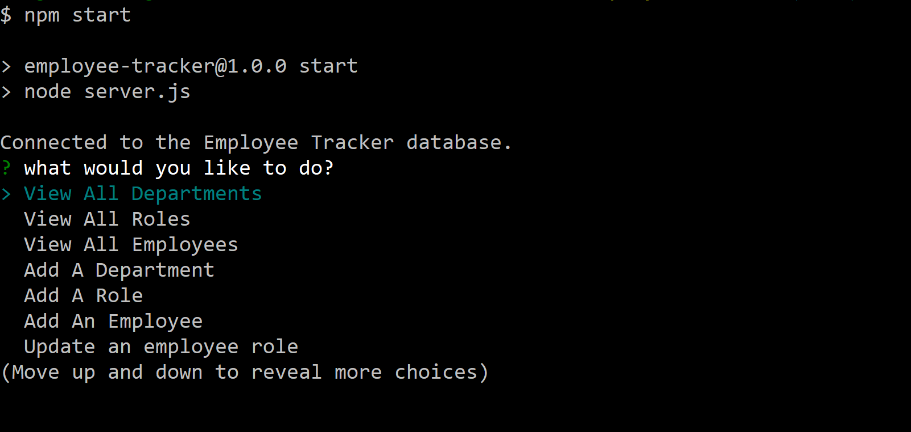

# Project Title
Employee Tracker

## Project Description
A command line application to manage a company’s employee database using Node.js, Inquirer, and MySQL

## Installation
Clone the repo, run npm install to get dependencies. Run npm start to connect to employee tracker database. 

## Technologies
Node.js
MySQL2
Inquirer package

## Usage
Use the application to manage employee database

## License 

## Screenshot

